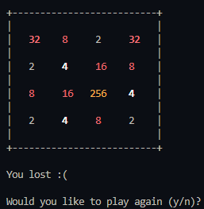

# LC3

An [LC3](https://en.wikipedia.org/wiki/Little_Computer_3) implementation in Zig.

It includes all operations and trap codes.

Currently works on Linux and Windows.

---



## Usage

```bash
$ zig version
0.14.0-dev.1671+085cc54aa
```

```bash
$ lc3 -h
 Usage:
  lc3 [options]

 Options:
  -h, --help                  Display this help
  -r <file>, --rom <file>     Runs the ROM file (required)
```

To build, use `zig build` or build and run with `zig build run -- -r <path-to-rom>`.
